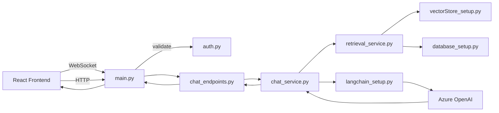
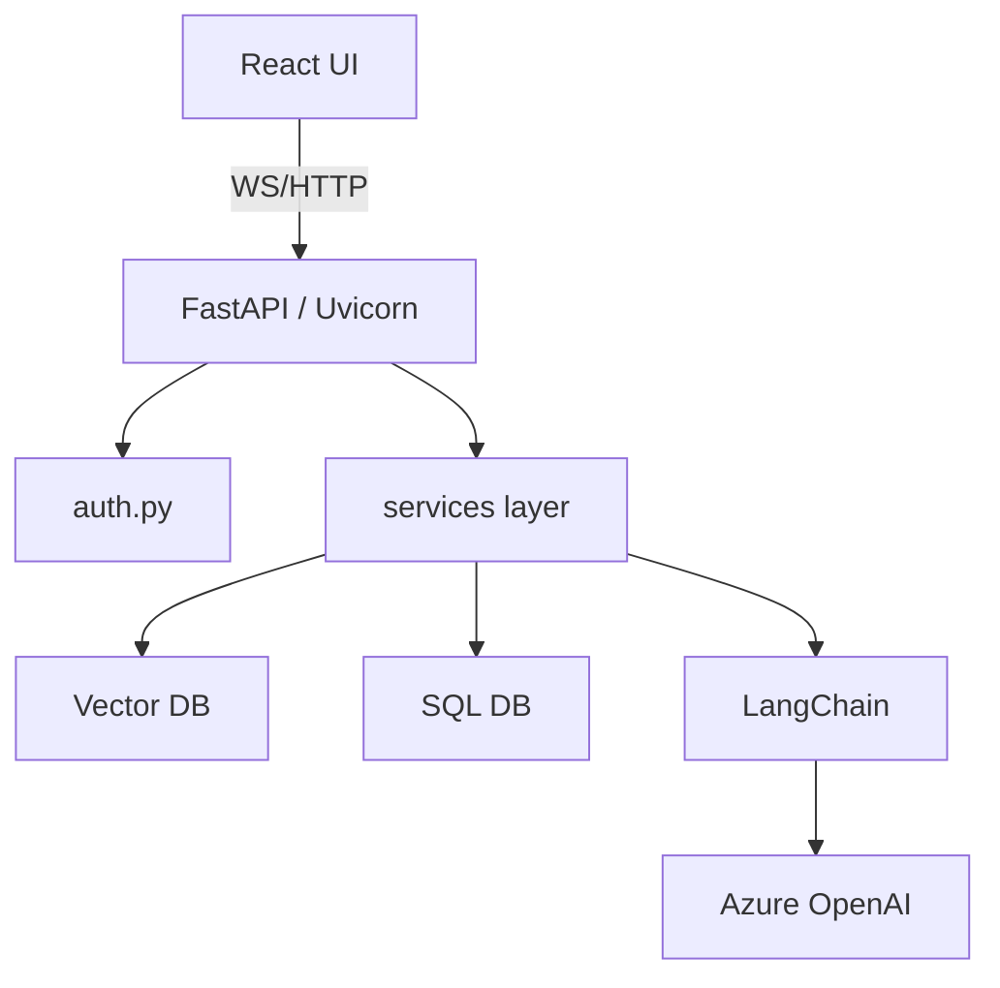
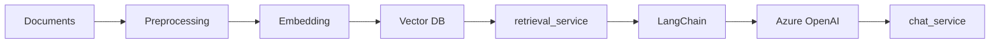
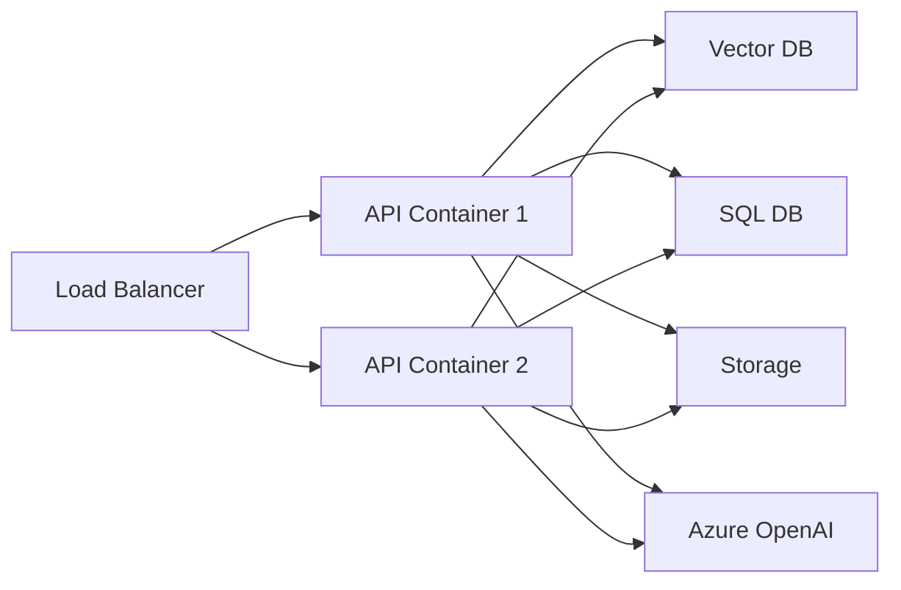

# Architecture Flow — QuickDoc Chatbot

This file provides a compact set of diagrams to help visualize the big-picture architecture and runtime flows for the Doctor Scheduling Assistant Chatbot.

## 1) System Flow (WebSocket + HTTP)

Notes:
- WebSocket flow is used for streaming chat, partial tokens, and low-latency messages.
- HTTP endpoints are used for CRUD operations and non-streaming requests.

## 2) Component Interaction Diagram (layered view)

This shows vertical separation: presentation, API, auth, service logic, and infra components.

## 3) Data & Indexing Pipeline

Notes:
- Embedding model can be the same provider as LLM or a separate model.
- Re-index when docs change or model changes.

## 4) Deployment Topology (suggested)

Recommendations:
- Use sticky sessions or a shared connection manager for WebSocket connections (or offload to a dedicated WebSocket gateway).
- Use a managed vector DB when possible for easier scaling.

## 5) Quick Mapping to Folder Structure

- `app/main.py`: App entry, router registration, startup/shutdown.
- `app/auth.py`: Token helpers and FastAPI dependency.
- `app/routers/*.py`: Endpoint definitions (WebSocket + REST).
- `app/services/*.py`: Business logic and orchestration.
- `app/core/*.py`: Infra wiring (LLM client, vector store, db sessions).

---

Open this file in VS Code and use a Mermaid preview extension to view the diagrams. If you want a PNG/SVG export or a whiteboard-style diagram, I can generate SVG files or a PlantUML version as well.
