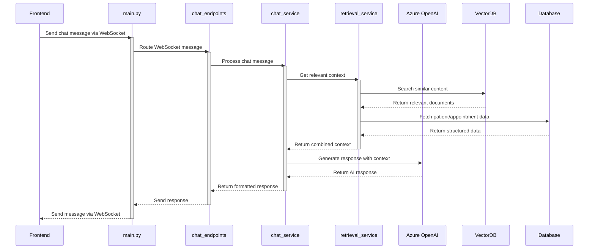

# Doctor Scheduling Assistant Chatbot - Sequence Diagram

Below is a sequence diagram showing how different components of the system interact when handling a chat request.

```mermaid
sequenceDiagram
    participant Frontend
    participant main.py
    participant chat_endpoints
    participant chat_service
    participant retrieval_service
    participant Azure OpenAI
    participant VectorDB
    participant Database

    Frontend->>main.py: Send chat message via WebSocket
    activate main.py
    
    main.py->>chat_endpoints: Route WebSocket message
    activate chat_endpoints
    
    chat_endpoints->>chat_service: Process chat message
    activate chat_service
    
    chat_service->>retrieval_service: Get relevant context
    activate retrieval_service
    
    retrieval_service->>VectorDB: Search similar content
    VectorDB-->>retrieval_service: Return relevant documents
    
    retrieval_service->>Database: Fetch patient/appointment data
    Database-->>retrieval_service: Return structured data
    
    retrieval_service-->>chat_service: Return combined context
    deactivate retrieval_service
    
    chat_service->>Azure OpenAI: Generate response with context
    Azure OpenAI-->>chat_service: Return AI response
    
    chat_service-->>chat_endpoints: Return formatted response
    deactivate chat_service
    
    chat_endpoints-->>main.py: Send response
    deactivate chat_endpoints
    
    main.py-->>Frontend: Send message via WebSocket
    deactivate main.py
```
